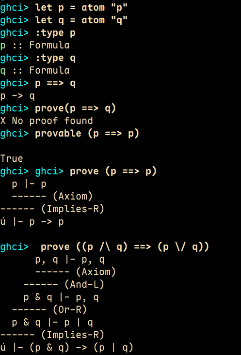

# Sequential Calculs

This is a quick sequential calculs implementation in haskell.

The way it works it your create formulas to prove and it will show how it proves them.

CITED PAPER: https://arxiv.org/pdf/2406.14719


## How it works.

Load the haskell file in interactive mode.

```bash
ghch> :load Main.hs
```

```haskell

let p = atom "p"
let q = atom "q"

prove(p ==> p) -- ==>: means implies

```

